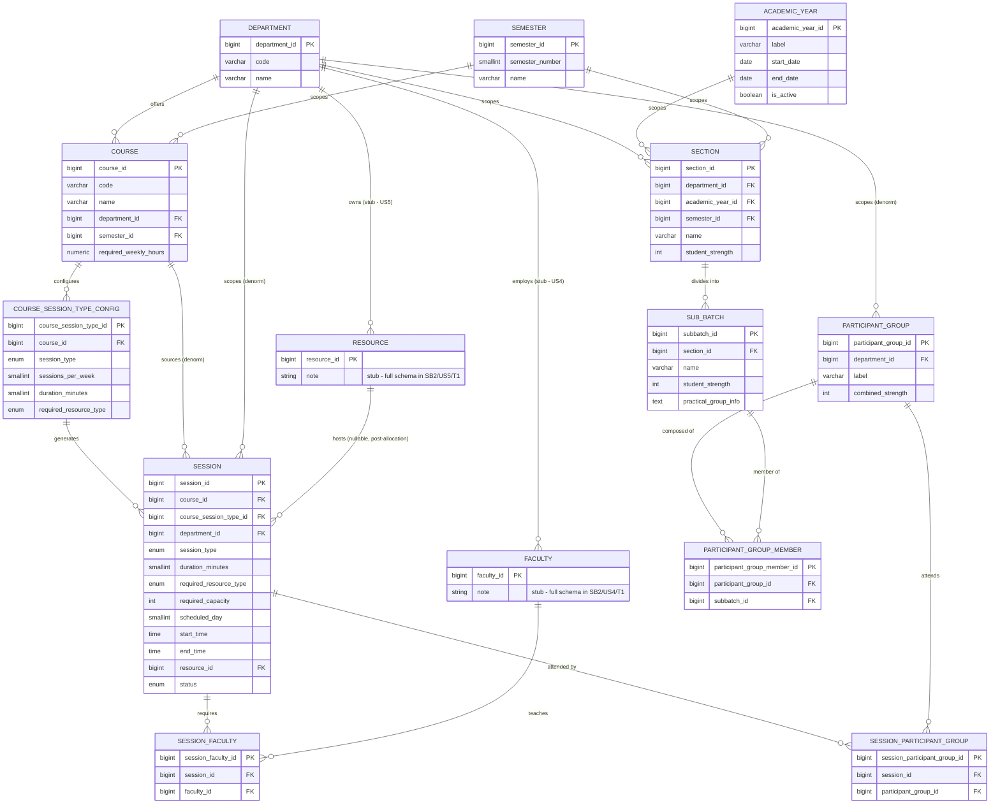

# Database Design — SB2/US2/T1: Academic Hierarchy ERD

**Project:** Smart Classroom & Timetable Scheduler (PIET/CS/2023-27/17)
**Task:** SB2/US2/T1 — Design ERD: Department, AcademicYear, Semester, Section, SubBatch, Course, Session, ParticipantGroup
**Owner:** Kushagra Gupta · **Sprint:** Sprint-II · **Due:** 13-Sep-26
**Feeds into:** SB2/US2/T2 (PostgreSQL schema + migrations), SB2/US8/T1 (Course-to-Session generation), SB2/US8/T2 (Participant Group resolution), SB2/US9/T1 (CP-SAT foundation)
**Source:** SRS_FINAL.pdf §3.1–3.4, §6.1–6.3, §7.1–7.2 (HC-01–HC-16), §2.2 (pipeline architecture)

---

## 1. Scope

This design covers exactly the eight entities assigned to SB2/US2/T1 — the **academic hierarchy** — in enough
depth to be migrated directly (SB2/US2/T2). Five entities that other sessions reference are drawn as **stubs**
because they belong to different user stories owned by other tasks. They're included only so the diagram and
foreign keys are honest about what this schema connects to:

| Stub entity | Owned by | Task |
|---|---|---|
| `Faculty` / `FacultyAvailability` | Kushagra | SB2/US4/T1–T2 |
| `Resource` / `ResourceAvailability` | Kushagra | SB2/US5/T1–T2 |
| `TimeSlot` / `Break` | Kushagra | SB2/US6/T1 |
| `User` / `Role` | Kushagra | SB2/US7/T1 |
| `Timetable`, `TimetableEntry`, `TimetableVersion`, `AcademicEvent`, `RescheduleEvent`, `MLDataset`, `MLModelVersion`, `Prediction` | — | Sprint-III (SB3/US5–US7) |

Building these five as full tables now would pre-empt SB2/US4/T1, SB2/US5/T1, SB2/US6/T1 and SB2/US7/T1 and
risks schema drift once those tasks land. They appear here only as named boxes with PK columns so referential
integrity is visible end-to-end.

---

## 2. Key design decisions (read this before the tables)

These are the decisions that aren't obvious from the SRS's flat entity list in §6.1 — each one exists because a
specific requirement forced it.

1. **`CourseSessionTypeConfig` is a separate table from `Course`.**
   A course generates *multiple* sessions of *different* types with different weekly counts and durations
   (SRS example: DBMS → 3×1h Lecture + 1×2h Practical). HC-11 requires the system to schedule contact hours
   "according to its configured session types and durations — not a single undifferentiated hour total." A
   single `Course` row can't hold that; it needs a child table, one row per (course, session_type).

2. **`Session.course_id` *and* `Session.course_session_type_id` are both stored.**
   `course_session_type_id` is the real source of truth (§FR-3.3.6: "derive sessions from a course based on
   configured session types"). `course_id` is a deliberate denormalization — nearly every query in the
   Session Builder, Coordinator dashboard, and reporting module (§3.14) filters "sessions for course X," and
   without it every such query needs an extra join through the config table.

3. **`SessionFaculty` is a many-to-many junction, not a `faculty_id` column on `Session`.**
   SRS §7.1 explicitly defines `Y(session, faculty)` as a CP-SAT auxiliary variable and requires HC-01
   (Faculty Clash) and HC-05 (Faculty Availability) to be checked *independently for every faculty member* on
   multi-faculty sessions (FR-3.3.4 — joint project guidance by Faculty X, Y, Z). A scalar column can't
   represent that.

4. **`ParticipantGroup` is a standalone, reusable entity — not an inline list on `Session`.**
   The SRS treats it as a first-class concept ("a participant group represents the actual student population…
   a session references one or more participant groups," §3.3) precisely because the *same* group (e.g.
   D1+D2) recurs across many sessions in a week. Making it reusable means HC-13 (participant-group
   consistency) is validated once per group, not re-derived per session.

5. **`SessionParticipantGroup` is many-to-many**, even though almost every real scenario in the SRS appendix
   (10.1, Scenarios A–H) uses exactly one group per session. The SRS's own wording is "one or more
   participant groups" (§6.2), so the schema supports it literally rather than silently narrowing the spec.
   The application layer can still enforce "exactly one" as a business rule if the team decides that's cleaner
   during SB2/US8/T2 — the schema doesn't foreclose either option.

6. **Every `Section` must have at least one `SubBatch` row, even if it's never subdivided.**
   `ParticipantGroupMember` only ever points at `sub_batches`. Rather than adding a second, parallel
   "whole-section membership" path, an undivided section gets one SubBatch representing 100% of it (e.g.
   Section D with no split gets a single SubBatch "D-ALL"). This keeps HC-13 validation, capacity summation,
   and the allocator's scoring logic (FR-3.8.2) working off one uniform join path instead of two.

7. **`Session.resource_id` is a nullable FK, and stays null through most of the pipeline.**
   SRS §2.2 and §3.4 are explicit and repeated: CP-SAT "never" assigns a resource; Smart Resource Allocation
   is "the sole assigner of resources in the pipeline" and runs strictly after feasibility. Making the column
   nullable — rather than inventing a separate `SessionResourceAssignment` table — mirrors that staged
   pipeline directly: a session with `resource_id IS NULL` and `status = 'FEASIBLE'` is a CP-SAT output that
   hasn't reached the allocator yet; that's a meaningful, queryable state, not an error.

8. **`department_id` is denormalized onto `Session` and `ParticipantGroup`**, even though it's technically
   derivable via `Course.department_id` or `SubBatch → Section.department_id`.
   NFR-3 requires "department-level access isolation" for the Coordinator role, who is explicitly "scoped to
   own department" (§2.4). Every API call from a Coordinator needs a department filter; without the
   denormalized column, that filter needs a multi-table join on every single request. This is the one place
   in the design that intentionally trades a small update-sync cost for RBAC query performance.

9. **`Section.num_subbatches` from the SRS's field list is *not* stored as a column.**
   It's a `COUNT(*)` over `sub_batches` for that section. Storing it invites the classic update-anomaly (add a
   sub-batch, forget to bump the counter). The SRS lists it as a data field, not necessarily a stored one — the
   ERD favors correctness over matching the SRS's field list literally here.

10. **`ParticipantGroup.combined_strength` *is* stored (cached), unlike `Section.num_subbatches` above.**
    This one goes the other way on purpose: FR-3.8.2 says the resource allocator's per-candidate scoring pass
    combines "capacity, availability, equipment, requirement match, **participant strength**, predicted
    demand, and location" — this runs once per candidate resource per session, potentially many times during
    optimization. Recomputing `SUM(sub_batch.student_strength)` via a join on every scoring call is wasteful
    for a value that only changes when group membership changes. It must be kept in sync (trigger or
    application-layer) whenever `ParticipantGroupMember` rows are inserted/deleted.

11. **`session_type` and `resource_type` are native PostgreSQL `ENUM`s, not lookup tables.**
    Both lists are closed and explicitly frozen by the SRS (§3.3 lists exactly 6 session types; §3.2 lists
    exactly 4 resource types, matched by HC-08/HC-09). A lookup table would only pay off if new types were
    expected; here it would just add a join for zero benefit. Trade-off noted: adding a 7th session type later
    means an `ALTER TYPE … ADD VALUE` migration, which is an acceptable cost for a fixed taxonomy.

12. **Semester is a lookup entity (`semester_number` 1–8), not nested under Department.**
    The SRS diagram draws "Department → Semester → Section → Sub-Batch" as a conceptual hierarchy (§3.1,
    Figure 3), but "7th Semester" is the same concept in CSE as it is in ECE — it doesn't need to exist once
    per department. `Section` is the entity that actually ties department + semester + academic year together
    (it already carries all three per the SRS field list), so `Semester` stays a shared, small reference table.

13. **`Session.status` is an explicit lifecycle enum**, not inferred from which nullable columns are filled.
    It mirrors the pipeline stages in Figure 1 (`DRAFT → FEASIBLE → RESOURCE_ALLOCATED → VALIDATED`) plus two
    terminal states the SRS calls out by name: `CANCELLED` (§3.9 triggers) and `REPLACED_BY_EVENT` (FR-3.10.4
    — an Academic Event replacing a session "for the affected participants only"). An explicit column makes
    FR-3.11.2 (surfacing infeasibility diagnostics to the UI, not just the log) a simple filtered query instead
    of inferred state-guessing.

14. **Cross-row aggregate constraints (e.g. "sum of sub-batch strengths ≤ section strength") are *not* SQL
    `CHECK` constraints.** PostgreSQL `CHECK` constraints only see a single row. Enforcing this needs either a
    trigger or application-layer validation — this design defers to FR-3.11.1 ("validate all data entry against
    defined field constraints"), which is explicitly owned by a later task (SB3/US4/T1), so the ERD documents
    the rule here but doesn't hard-code it into a constraint that SB3/US4/T1 would then have to work around.

---

## 3. Entity definitions (in scope for SB2/US2/T1)

Types are written as PostgreSQL types. All PKs use `BIGINT GENERATED ALWAYS AS IDENTITY` (simple, sequential,
sufficient for a single-instance department-scale system — no distributed-ID need here, so UUID wasn't chosen).

### 3.1 `departments`
| Column | Type | Constraints |
|---|---|---|
| department_id | BIGINT | PK |
| code | VARCHAR(20) | UNIQUE, NOT NULL — e.g. `CSE` |
| name | VARCHAR(150) | NOT NULL |
| created_at, updated_at | TIMESTAMPTZ | NOT NULL DEFAULT now() |

### 3.2 `academic_years`
| Column | Type | Constraints |
|---|---|---|
| academic_year_id | BIGINT | PK |
| label | VARCHAR(20) | UNIQUE, NOT NULL — e.g. `2026-27` |
| start_date | DATE | NOT NULL |
| end_date | DATE | NOT NULL, CHECK (end_date > start_date) |
| is_active | BOOLEAN | NOT NULL DEFAULT false |

### 3.3 `semesters`
| Column | Type | Constraints |
|---|---|---|
| semester_id | BIGINT | PK |
| semester_number | SMALLINT | UNIQUE, NOT NULL, CHECK (BETWEEN 1 AND 8) |
| name | VARCHAR(30) | NOT NULL — e.g. `7th Semester` |

### 3.4 `sections`
| Column | Type | Constraints |
|---|---|---|
| section_id | BIGINT | PK |
| department_id | BIGINT | FK → departments, NOT NULL |
| academic_year_id | BIGINT | FK → academic_years, NOT NULL |
| semester_id | BIGINT | FK → semesters, NOT NULL |
| name | VARCHAR(50) | NOT NULL — e.g. `D` |
| student_strength | INT | NOT NULL, CHECK (> 0) |
| created_at, updated_at | TIMESTAMPTZ | NOT NULL DEFAULT now() |

UNIQUE (department_id, academic_year_id, semester_id, name) — same section name can't repeat within one
department/year/semester.
*(`num_subbatches` intentionally omitted — see Decision 9.)*

### 3.5 `sub_batches`
| Column | Type | Constraints |
|---|---|---|
| subbatch_id | BIGINT | PK |
| section_id | BIGINT | FK → sections, NOT NULL |
| name | VARCHAR(50) | NOT NULL — e.g. `D1` |
| student_strength | INT | NOT NULL, CHECK (> 0) |
| practical_group_info | TEXT | NULL — free-form per SRS §3.1; revisit as JSONB if structure emerges |

UNIQUE (section_id, name).

### 3.6 `courses`
| Column | Type | Constraints |
|---|---|---|
| course_id | BIGINT | PK |
| code | VARCHAR(20) | NOT NULL — e.g. `CS701` |
| name | VARCHAR(150) | NOT NULL — e.g. `DBMS` |
| department_id | BIGINT | FK → departments, NOT NULL |
| semester_id | BIGINT | FK → semesters, NOT NULL |
| required_weekly_hours | NUMERIC(4,1) | NOT NULL, CHECK (> 0) — reporting/reference value; actual scheduling target is the sum over `course_session_type_configs` |

UNIQUE (department_id, semester_id, code).

### 3.7 `course_session_type_configs`
The table that makes HC-11 and FR-3.3.6 possible — see Decision 1.

| Column | Type | Constraints |
|---|---|---|
| course_session_type_id | BIGINT | PK |
| course_id | BIGINT | FK → courses, NOT NULL |
| session_type | session_type_enum | NOT NULL — `LECTURE / PRACTICAL / TUTE_ASSIGNMENT / PROJECT / SEMINAR / EVENT` |
| sessions_per_week | SMALLINT | NOT NULL, CHECK (> 0) |
| duration_minutes | SMALLINT | NOT NULL, CHECK (> 0) |
| required_resource_type | resource_type_enum | NULL — `CLASSROOM / LABORATORY / SEMINAR_HALL / AUDITORIUM`; NULL = any suitable type |

UNIQUE (course_id, session_type) — one config row per session type per course.

### 3.8 `sessions`
The atomic schedulable unit (§3.3). See Decisions 2, 7, 8, 13.

| Column | Type | Constraints |
|---|---|---|
| session_id | BIGINT | PK |
| course_id | BIGINT | FK → courses, NOT NULL *(denormalized — Decision 2)* |
| course_session_type_id | BIGINT | FK → course_session_type_configs, NOT NULL |
| session_type | session_type_enum | NOT NULL — copy of the config's type, kept in sync by app logic / trigger |
| department_id | BIGINT | FK → departments, NOT NULL *(denormalized — Decision 8, RBAC)* |
| duration_minutes | SMALLINT | NOT NULL |
| required_resource_type | resource_type_enum | NULL — carried through from config for the allocator (§7.1: "carried as session metadata") |
| required_capacity | INT | NULL — filled once participant group(s) attached (FR-3.3.2) |
| scheduled_day | SMALLINT | NULL, CHECK (BETWEEN 1 AND 7) — set by CP-SAT |
| start_time | TIME | NULL — set by CP-SAT |
| end_time | TIME | NULL — set by CP-SAT |
| resource_id | BIGINT | FK → resources (stub), NULL *(Decision 7)* |
| status | session_status_enum | NOT NULL DEFAULT `DRAFT` — `DRAFT / FEASIBLE / RESOURCE_ALLOCATED / VALIDATED / CANCELLED / REPLACED_BY_EVENT` |
| created_at, updated_at | TIMESTAMPTZ | NOT NULL DEFAULT now() |

Note: `start_time`/`end_time` are stored as concrete scalars rather than an FK into a fixed `TimeSlot` grid,
because HC-14 requires multi-hour sessions to occupy "a continuous, uninterrupted interval… not necessarily
aligned to a fixed one-hour slot grid." `TimeSlot` (stub, owned by SB2/US6/T1) remains useful for *preference*
and *availability* modelling, just not as the mechanism that pins down where a session actually lands.

### 3.9 `session_faculty` (junction — Decision 3)
| Column | Type | Constraints |
|---|---|---|
| session_faculty_id | BIGINT | PK |
| session_id | BIGINT | FK → sessions, NOT NULL, ON DELETE CASCADE |
| faculty_id | BIGINT | FK → faculty (stub), NOT NULL |

UNIQUE (session_id, faculty_id).

### 3.10 `participant_groups` (Decision 4)
| Column | Type | Constraints |
|---|---|---|
| participant_group_id | BIGINT | PK |
| department_id | BIGINT | FK → departments, NOT NULL *(denormalized — Decision 8)* |
| label | VARCHAR(100) | NULL — display label, e.g. `D1+D2`, auto-derivable but editable |
| combined_strength | INT | NOT NULL DEFAULT 0 *(cached — Decision 10)* |
| created_at, updated_at | TIMESTAMPTZ | NOT NULL DEFAULT now() |

### 3.11 `participant_group_members` (junction)
| Column | Type | Constraints |
|---|---|---|
| participant_group_member_id | BIGINT | PK |
| participant_group_id | BIGINT | FK → participant_groups, NOT NULL, ON DELETE CASCADE |
| subbatch_id | BIGINT | FK → sub_batches, NOT NULL |

UNIQUE (participant_group_id, subbatch_id). Application layer enforces HC-13 here: every referenced sub-batch
must belong to a section permitted for the session being built (FR-3.3.2, §6.3).

### 3.12 `session_participant_groups` (junction — Decision 5)
| Column | Type | Constraints |
|---|---|---|
| session_participant_group_id | BIGINT | PK |
| session_id | BIGINT | FK → sessions, NOT NULL, ON DELETE CASCADE |
| participant_group_id | BIGINT | FK → participant_groups, NOT NULL |

UNIQUE (session_id, participant_group_id).

### 3.13 Enum types
```sql
CREATE TYPE session_type_enum AS ENUM
    ('LECTURE','PRACTICAL','TUTE_ASSIGNMENT','PROJECT','SEMINAR','EVENT');

CREATE TYPE resource_type_enum AS ENUM
    ('CLASSROOM','LABORATORY','SEMINAR_HALL','AUDITORIUM');

CREATE TYPE session_status_enum AS ENUM
    ('DRAFT','FEASIBLE','RESOURCE_ALLOCATED','VALIDATED','CANCELLED','REPLACED_BY_EVENT');
```

---

## 4. Relationships & cardinalities

| From | To | Cardinality | Notes |
|---|---|---|---|
| Department | Section | 1 : N | a department has many sections across years/semesters |
| AcademicYear | Section | 1 : N | |
| Semester | Section | 1 : N | |
| Section | SubBatch | 1 : N | every section has ≥1 sub-batch (Decision 6) |
| Department | Course | 1 : N | |
| Semester | Course | 1 : N | |
| Course | CourseSessionTypeConfig | 1 : N | one row per session type the course generates |
| CourseSessionTypeConfig | Session | 1 : N | each config spawns `sessions_per_week` Session rows over the term |
| Course | Session | 1 : N | denormalized shortcut (Decision 2) |
| Department | Session | 1 : N | denormalized RBAC scope (Decision 8) |
| Session | Faculty | M : N | via `session_faculty` (Decision 3) |
| Session | ParticipantGroup | M : N | via `session_participant_groups` (Decision 5) |
| ParticipantGroup | SubBatch | M : N | via `participant_group_members` |
| Department | ParticipantGroup | 1 : N | denormalized RBAC scope |
| Resource (stub) | Session | 1 : N | nullable until Smart Resource Allocation runs (Decision 7) |
| Department | Faculty (stub) | 1 : N | owned by SB2/US4/T1 |
| Department | Resource (stub) | 1 : N | owned by SB2/US5/T1 |

---

## 5. Mermaid ER Diagram



---

## 6. Requirement traceability

| SRS ref | Requirement | Schema element |
|---|---|---|
| HC-11 | Weekly contact hours per configured session type/duration | `course_session_type_configs` (sessions_per_week × duration_minutes per type) |
| HC-13 | Participant-group sub-batches must belong to a permitted section | `participant_group_members` + app-layer validation on insert |
| HC-14 | Multi-hour sessions occupy a continuous, non-grid-aligned interval | `sessions.start_time` / `end_time` as free scalars, not FK to a fixed slot |
| HC-16 | Multi-section combined capacity ≤ resource capacity | `sessions.required_capacity`, validated against `resources.capacity` (stub) at allocation time |
| FR-3.3.1 | Arbitrary sub-batch combinations in one session | `participant_group_members` (M:N) |
| FR-3.3.2 | Verify combined strength / faculty availability / candidate resource before accepting grouping | `participant_groups.combined_strength`, `session_faculty`, `sessions.required_resource_type` |
| FR-3.3.3 | Multi-section sessions | `session_participant_groups` (M:N) — groups can span sections |
| FR-3.3.4 | Multi-faculty sessions, validated independently per faculty | `session_faculty` (M:N) |
| FR-3.3.6 | Sessions derived from course's session-type config | `course_session_type_configs` → `sessions` |
| §7.1 | CP-SAT never assigns a resource | `sessions.resource_id` nullable, filled only by Smart Resource Allocation |
| NFR-3 | Department-level access isolation | `department_id` denormalized on `sessions`, `participant_groups` |
| §3.11 / FR-3.11.2 | Surface infeasibility diagnostics, not silent failure | `sessions.status` enum with distinct `DRAFT/FEASIBLE/...` states |

---

## 7. Indexing recommendations (for SB2/US2/T2)

- `sessions(department_id, scheduled_day, start_time)` — the hot path for every clash check (HC-01–HC-04) and
  every dashboard/timetable view query.
- `sessions(course_session_type_id)` — session generation and regeneration lookups.
- `session_faculty(faculty_id)` — faculty-availability clash checks (HC-01, HC-05) scan by faculty, not session.
- `participant_group_members(subbatch_id)` — needed to find every group a sub-batch belongs to when checking
  HC-04 (sub-batch clash) and during dynamic rescheduling's "affected participants" computation (FR-3.9.2).
- `sub_batches(section_id)`, `sections(department_id, academic_year_id, semester_id)` — hierarchy traversal for
  the Coordinator's setup screens (§5.1).

---

## 8. Assumptions

- One PostgreSQL instance, single region — surrogate keys are `BIGINT IDENTITY`, not UUID.
- `practical_group_info` stays free-text `TEXT` until a concrete structured need appears (no requirement in the
  SRS specifies its shape beyond "Practical group information," §3.1).
- The five stub entities (Faculty, Resource, TimeSlot, User/Role, Timetable family) are **not** created by this
  migration — SB2/US2/T2 should create `sessions.resource_id` as a *deferred* FK (add constraint once
  `resources` exists in SB2/US5/T2) rather than blocking on tables owned by other tasks.
